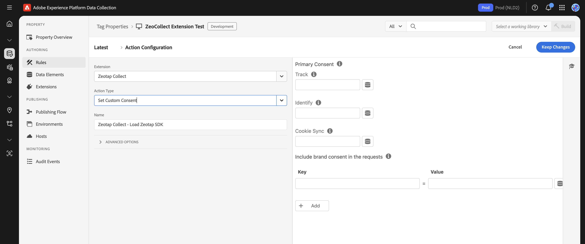

# Set Custom Consent Action

### Purpose

The **Set Custom Consent** action, when added to an Adobe Launch rule, allows you to explicitly send user consent information to the Zeotap SDK. This helps you in sending following:

*   **Primary Consent:** Whether the user has consented to core SDK functionalities like event tracking (`track`) and cookie syncing (`cookieSync`).
*   **Brand Consent:** Additional, specific consent preferences the user might have (e.g., for newsletters, personalization, or other brand-specific data uses).

### Setup

To configure the **Set Custom Consent** action within a rule:

1.  **Create or Edit a Rule:** Start by creating a new rule or editing an existing one. You might name it `Handle User Consent Update` or `Process CMP Consent Signal`.
2.  **Define the Rule's Event (Trigger):** Specify what should trigger this rule. This is crucial and should align with how your website captures consent. Common triggers include:
    *   A `Core - Click` event on your "Accept Cookies" or "Save Preferences" button in a custom consent banner.
    *   A custom `dataLayer` event pushed by your Consent Management Platform (CMP) when a user makes or updates their consent choices.
    *   A `Direct Call Rule` triggered by JavaScript logic that processes consent.
    *   A change in a Data Element that reflects the user's consent status.
3.  **Add and Configure the Action:**
    *   In the "Actions" section of your rule, click "Add".
    *   Set the **Extension** to **Zeotap Collect**.
    *   Set the **Action Type** to **Set Custom Consent**.
    *   **Configure Consent Properties:** Within the action settings, you will define the consent signals:
        *   **Primary Consent (if ["Custom Consent"](../configure#3-custom-consent) method is selected in extension configuratio):**
            *   `track` (Boolean): Set to `true` to allow event tracking, `false` to disallow. You'll map this to a Data Element that reflects the user's choice for tracking.
            *   `cookieSync` (Boolean): Set to `true` to allow cookie syncing, `false` to disallow. Map this to a Data Element reflecting the user's choice for cookie syncing.
        *   **Brand Consent (always available to send):**
            *   You can add custom key-value pairs to represent specific brand-level consents. These are sent to Zeotap regardless of the primary `track` or `cookieSync` status and are useful for recording granular permissions.
            *   Example:
                *   `newsletter_opt_in`: `true` (or a Data Element `%Newsletter Consent%`)
                *   `personalization_allowed`: `%Personalization Preference%` (Data Element)

> **Using Data Elements**: It is highly recommended to use Adobe Launch **Data Elements** to dynamically provide the values for `track`, `cookieSync`, and any brand consent properties. These Data Elements should be configured to read the consent status from your website's consent mechanism (e.g., CMP API, cookie values, data layer variables).

### How it Works with Global Consent Settings

*   **If "Custom Consent" is the global Consent Method:** The `track` and `cookieSync` values you set in this action directly control whether the Zeotap SDK will perform those operations. The SDK will wait for this action to be triggered before sending tracking events or initiating cookie syncs.
*   **If "Default Opt-in" or "TCF (GDPR)" is the global Consent Method:**
    *   The Primary consent is resolved by the selected mechanism.
    *   However, you can still use this action to send **Brand Consent** key-value pairs. These will be processed and sent to Zeotap alongside any consent information derived from the TCF CMP or default opt-in status. This is useful for capturing additional, non-TCF consents.

**Important Considerations:**

*   **Trigger Accuracy:** Ensure the rule containing this action is triggered reliably and accurately reflects the user's current consent state.
*   **Data Element Mapping:** Correctly configure your Data Elements to fetch the consent values from your website's consent solution.
*   **Timing:** This action should ideally fire as soon as a user makes or updates their consent choices.
