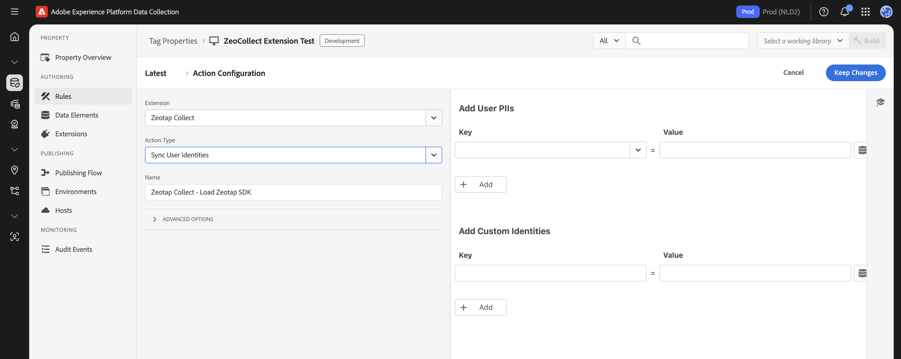

# Sync User Identity Action

### Purpose

The **Sync User Identity** action, when added to an Adobe Launch rule, is used to send various user identifiers to Zeotap. This is crucial for building user profiles and enabling identity resolution. Identifiers can include standard PII like email addresses and phone numbers (which can be raw or pre-hashed based on your extension configuration), as well as custom identifiers like CRM IDs, loyalty numbers, or Adobe Experience Cloud IDs (ECID).

:::tip
These identifiers are persisted and passed in subsequent event calls to Zetoap.
:::

### Setup

To configure the **Sync User Identity** action within a rule:

1.  **Create or Edit a Rule:** Start by creating a new rule or editing an existing one. A common name for such a rule might be `Sync User Identity on Login` or `Identify User on Data Update`.
2.  **Define the Rule's Event (Trigger):** Specify what should trigger this rule. Common triggers include:
    *   A **Direct Call Rule** (e.g., with an identifier like `sync_identity` or `zeotap_identify_user`) fired from your website's JavaScript when identity information becomes available (like after a user logs in or updates their profile).
    *   A `dataLayer` event that signifies a user has logged in or provided identifiable information.
    *   A `Core - DOM Ready` or `Core - Library Loaded` event if identity information is consistently available early in the page load from a data layer or JavaScript variables.
3.  **Add and Configure the Action:**
    *   In the "Actions" section of your rule, click "Add".
    *   Set the **Extension** to **Zeotap Collect**.
    *   Set the **Action Type** to **Sync User Identity**.
    *   **Configure Identity Fields:** Within the action settings, you will map the user identifiers you want to send.
        *   For each identifier (e.g., `email`, `cellno`, `loginid`, `custom_id_1`), you will select an Adobe Launch **Data Element** that holds the value for that identifier.
        *   Ensure the Data Elements are correctly configured to pick up the identifier values from your website (e.g., from the `dataLayer`, JavaScript variables, cookies, or the `detail` object of a Direct Call Rule).
        *   The specific fields available and how you map them will depend on the "Identity and Hashing Settings" you've configured in the main Zeotap Collect Extension settings (e.g., whether you're sending raw PII for SDK-side hashing, or pre-hashed PII).

### Example: Triggering with a Direct Call Rule

If you're using a Direct Call Rule with the identifier `sync_identity` to trigger the rule containing the "Sync User Identity" action, you might fire it from your website's JavaScript like this:

```javascript
// Example: After a successful user login or when identity data is available
_satellite.track('sync_identity', {
  email: 'user@example.com',         // This value would be picked up by a Data Element mapped to 'email'
  userId: 'customer123',           // This value would be picked up by a Data Element mapped to 'loginid' or a custom ID
  hashed_phone_sha256: 'abc...'    // If sending pre-hashed phone, mapped to the appropriate hashed phone field
});
```


> 
