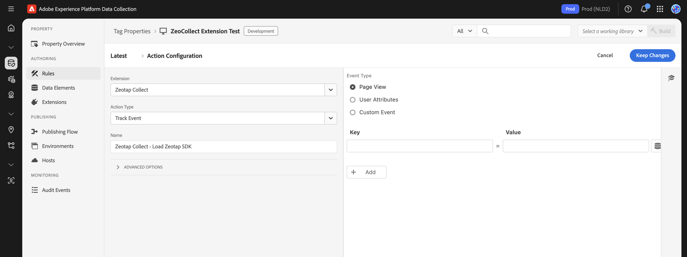

## Purpose

The **Track Event** action, when added to an Adobe Launch rule, allows you to send various types of event data to Zeotap. This includes standard page views, custom user interactions (like clicks or form submissions), and specific user-level attributes.

## Setup

To configure the **Track Event** action within a rule:

1.  **Create or Edit a Rule:** Start by creating a new rule or editing an existing one. You might name it based on what you intend to track, for example, `Track Page View - All Pages` or `Track Add to Cart Click`.
2.  **Define the Rule's Event (Trigger):** Specify what should trigger this rule. This could be a standard Adobe Launch event like `Core - Library Loaded (Page Top)` for page views, `Core - Click` for click tracking, `Core - DOM Ready`, or a custom `Direct Call Rule` for more specific scenarios.
3.  **Add and Configure the Action:**
    *   In the "Actions" section of your rule, click "Add".
    *   Set the **Extension** to **Zeotap Collect**.
    *   Set the **Action Type** to **Track Event**.

    Once you've selected "Track Event" as the Action Type, you'll configure its behavior using the "Event Type" dropdown. This determines what kind of data this specific action instance will send:

    ### Option A: Page View
    *   **Purpose**: Use this option to track a page view event. This is typically configured to fire once per page load.
    *   **Configuration**:
        *   Select **Page View** from the "Event Type" dropdown within the Track Event action settings.
        *   **(Optional) Add Properties**: You can enhance the page view data by adding key-value pairs for additional page-specific context. For example:
            *   `page_name`: `Homepage` (often populated using a Data Element like `%Page Name%`)
            *   `page_category`: `Product Listing` (using a Data Element like `%Page Category%`)
            *   `content_group`: `Blog`

    ### Option B: User Properties
    *   **Purpose**: Use this option to send user-level attributes to Zeotap. Configuring the action this way will trigger an event named `set_user_properties` to Zeotap, containing the attributes you define. These properties are generally not persisted by the SDK for subsequent, different events.
    *   **Configuration**:
        *   Select **User Properties** from the "Event Type" dropdown within the Track Event action settings.
        *   **Add Properties**: Define the user attributes as key-value pairs. For example:
            *   `user_segment`: `premium_tier` (using a Data Element like `%User Segment%`)
            *   `last_login_date`: `%Last Login Date%` (using a Data Element)
            *   `newsletter_subscriber`: `true` (can be a static value or a Data Element)

    ### Option C: Custom Event
    *   **Purpose**: Use this option to track specific user interactions or custom business events that aren't standard page views (e.g., button clicks, form submissions, video plays).
    *   **Configuration**:
        *   Select **Custom Event** from the "Event Type" dropdown within the Track Event action settings.
        *   **Event Name**: A text box will appear. Enter the desired name for your custom event (e.g., `add_to_cart`, `video_completed`, `newsletter_signup`). This name will be sent to Zeotap.
        *   **Add Properties**: Define key-value pairs relevant to this custom event. For example, for an `add_to_cart` event:
            *   `product_id`: `%Product ID%` (using a Data Element)
            *   `product_name`: `%Product Name%` (using a Data Element)
            *   `price`: `%Product Price%` (using a Data Element)
            *   `quantity`: `1` (can be a static value or a Data Element)

> **Using Data Elements**: For dynamic values (like product details, page names, or user segments), it's highly recommended to use Adobe Launch **Data Elements**. You can then reference these Data Elements in the property value fields within the action configuration using the `%DataElementName%` syntax.

> 
