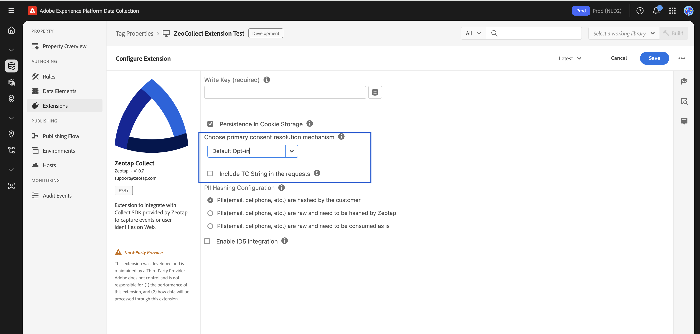
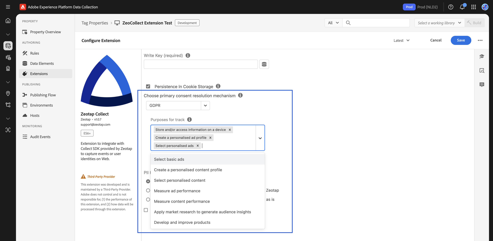
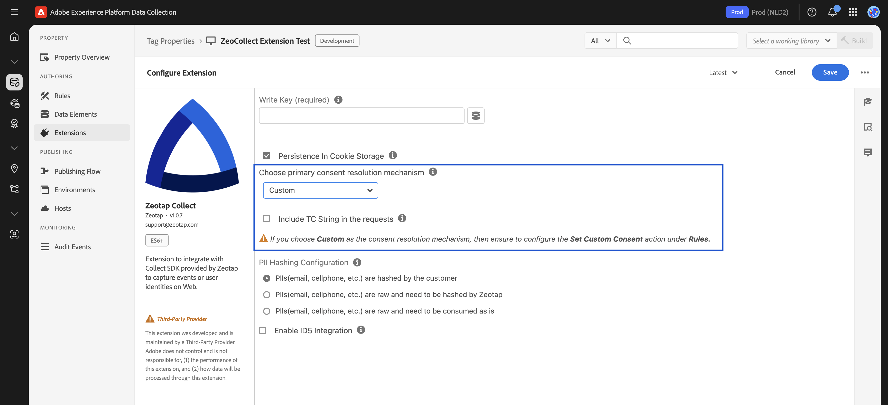
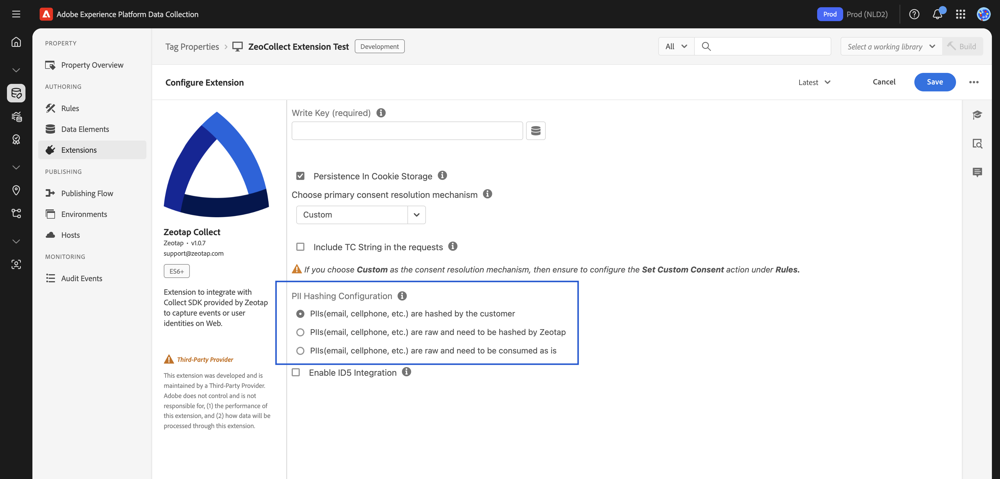
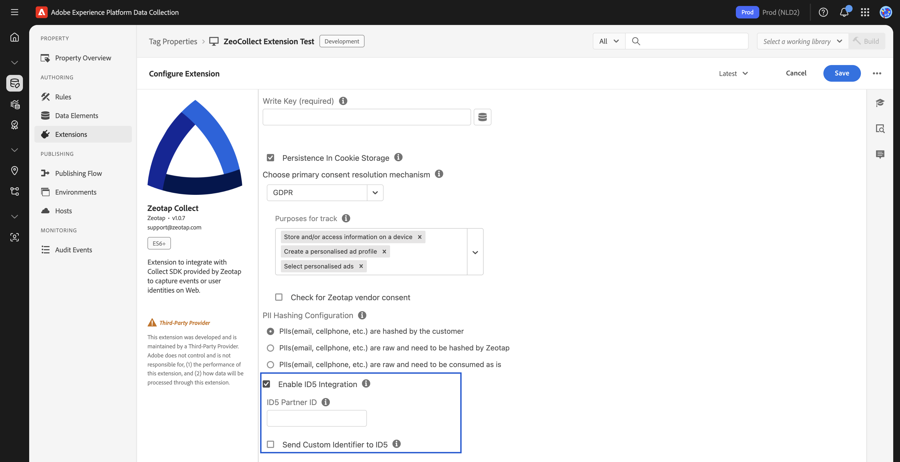

# Configuring the Zeotap Collect Extension

After installing the Zeotap Collect Extension in Adobe Launch, the next step is to configure it with your required tracking and consent settings. This includes setting up your Write Key, choosing a consent method, configuring identity handling, and optionally enabling ID5 support.

> All settings are available inside the **Zeotap Collect** extension configuration screen (under the **Installed Extensions** tab).

---

## Core Configuration Fields

### Write Key

- **Purpose**: This is your unique identifier for data collection, provided by Zeotap.
- **Action**: Enter the Zeotap **Write Key** assigned to your organization or environment.

---

### Consent Method

- **Purpose**: Defines how the tag handles user consent before collecting any data. Choose one of the following options based on your consent management strategy:

#### 1. Default Opt-in
*   **Description**: Assumes consent is granted by default. The Zeotap SDK will operate with tracking enabled.
*   **Use Case**: This option is generally recommended only in markets without strict consent regulations or if you manage consent entirely through other mechanisms (e.g., server-side, API integration) and the Adobe Launch tag should fire for users who have already provided consent through those means.
*   **Configuration**:
    *   Select "Default Opt-in" from the dropdown.
    *   You can check the `Include TC String in Requests` to pass the TC string in Payload if you have a TCF supported CMP setup.
    *   You can still use [`Set Custom Consent`](./Actions/setCustomConsent) within the extension to pass custom brand consent details if needed.

#### 2. TCF (GDPR)
*   **Description**: Integrates with IAB TCF v2.x compliant Consent Management Platforms (CMPs). The Zeotap SDK will automatically look for the `__tcfapi` provided by your CMP to fetch and respect user consent choices.
*   **Use Case**: Select this if you use an IAB TCF v2.0, v2.1, or v2.2 compliant CMP on your website to manage GDPR and ePrivacy consent.
*   **Configuration**:
    *   Select "TCF (GDPR)" from the dropdown.
    *   **Purposes for tracking of events**: You **must** select the purposes required for tracking.
    *   **(Optional) Check Zeotap Vendor Consent**: You can enable an option to also check for explicit consent for Zeotap as a vendor (ID 301) in the TC string.
    *   You can still use [`Set Custom Consent`](./Actions/setCustomConsent) within the extension to pass custom brand consent details if needed.
    

    

#### 3. Custom Consent
*   **Description**: Allows you to control consent explicitly using the [`Set Custom Consent`](./Actions/setCustomConsent) action within an Adobe Launch rule. The SDK will wait for these signals before acting.
*   **Use Case**: Select this if you have a non-TCF CMP, a custom-built consent banner, or need to manage consent signals based on specific `dataLayer` events or other custom logic on your site.
*   **Configuration**:
    *   Select "Custom Consent" from the dropdown.
    *   You **must** create a rule in Adobe Launch that uses the "Set Custom Consent" action from the Zeotap Collect Extension. This rule should be triggered by your consent mechanism (e.g., when a user clicks "Accept" on your banner or when your CMP fires a consent-ready event).
    *   Within the "Set Custom Consent" action, you will map Data Elements or provide static values for `track` and `cookieSync` booleans, and any brand consents.
    *   You can check the `Include TC String in Requests` to pass the TC string in Payload if you have a TCF supported CMP setup.

---

### Country Code

:::warning Depreacted
Country code usage is deprecated. Your IP address is used to resolve the country.
:::

- **Purpose**: Determines the data residency and storage policy for Zeotap ingestion.

---

## Identity and Hashing Settings

This section allows you to configure how Personally Identifiable Information (PII) like email, cellphone numbers, and other identifiers are collected and processed by Zeotap. Choose the option that best fits your data handling and privacy requirements:

### 1. PIIs are Hashed by the Customer
*   **Select this if:** Your application or backend systems already hash PII before it's made available to Adobe Launch (e.g., in the `dataLayer` or via Data Elements).
*   **Behavior:** The Zeotap Collect Extension will expect to receive already hashed PII values. You will need to map your Data Elements containing these pre-hashed values to the corresponding hashed PII fields in the ["Sync User Identity"](./Actions/syncUserIdentity) rule action (e.g., `email_sha256_lowercase`, `cellno_with_country_code_sha256`).
*   **Supported Formats:** Ensure your pre-hashed PII adheres to the formats Zeotap supports (e.g., SHA-256, MD5, SHA-1, with specific casing and normalization rules where applicable). Refer to the Web SDK documentation on PII Identifier Key Reference for details on expected hashed keys.

### 2. PIIs are Raw and Must Be Hashed by Zeotap
*   **Select this if:** You are sending raw (unhashed) PII to Adobe Launch (e.g., `user@example.com`, `15551234567`) and you want the Zeotap Collect Extension (leveraging the Web SDK's capabilities) to perform client-side hashing before the data is sent to Zeotap's backend.
*   **Behavior:** The extension will take the raw PII values (mapped via Data Elements in the ["Sync User Identity"](./Actions/syncUserIdentity) rule action to fields like `email` or `cellno`) and hash them using standard algorithms (SHA-256, MD5, SHA-1) before transmission.
*   **Benefit:** Enhances privacy by hashing PII in the user's browser.

### 3. PIIs are Raw and Must Be Consumed As Is
*   **Select this if:** You are sending raw PII and require Zeotap to receive and process these identifiers in their raw, unhashed form.
*   **Behavior:** The Zeotap Collect Extension will send the raw PII values (mapped via Data Elements in the ["Sync User Identity"](./Actions/syncUserIdentity) rule action to fields like `email` or `cellno`) directly to Zeotap's backend without any client-side hashing performed by the extension.
*   **Consideration:** Ensure this approach aligns with your data privacy policies and any agreements with Zeotap regarding the handling of raw PII.

> **Note:** Regardless of the chosen hashing configuration, you will use the ["Sync User Identity"](./Actions/syncUserIdentity)action within an Adobe Launch rule to map your Data Elements (containing either raw or pre-hashed PII, or other custom identifiers like CRM IDs or ECIDs) to the appropriate fields recognized by Zeotap.

---

### Optional: Enable ID5

If you plan to capture and sync ID5 identifiers:

- Enable the **ID5 Integration** checkbox.
- Add the [ID5 JavaScript snippet](https://www.id5.io) to your site.
- Provide a Data Element or JS variable that contains the `id5id`.

---

## Save and Publish

1. After completing all fields, click **Save**.
2. Return to the **Publishing Flow**.
3. Add the updated extension config to your active library.
4. Submit, approve, and publish the changes to your environment.

---