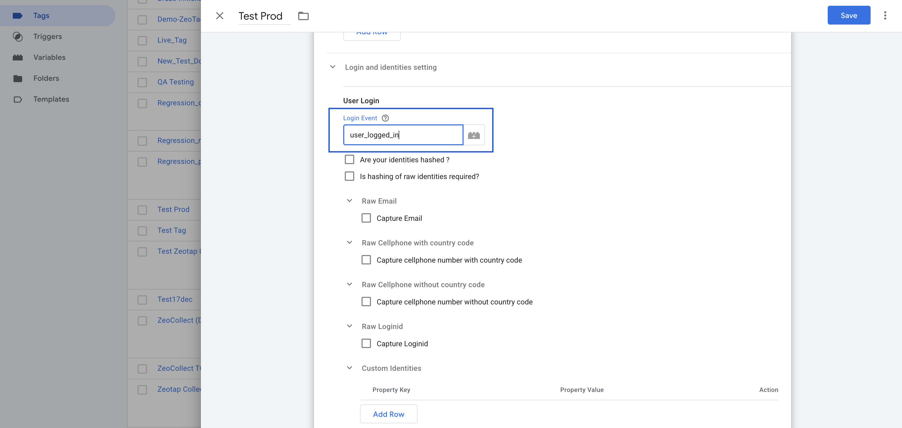
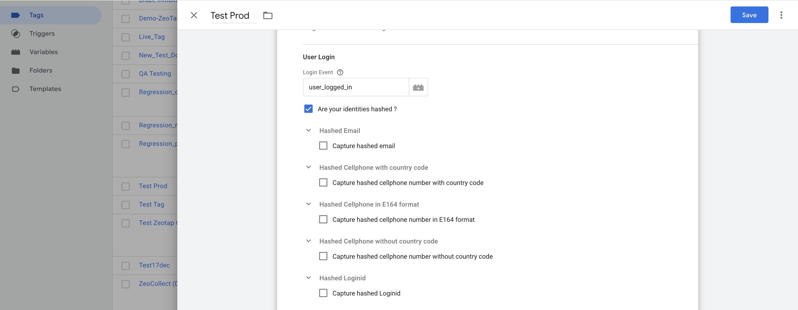
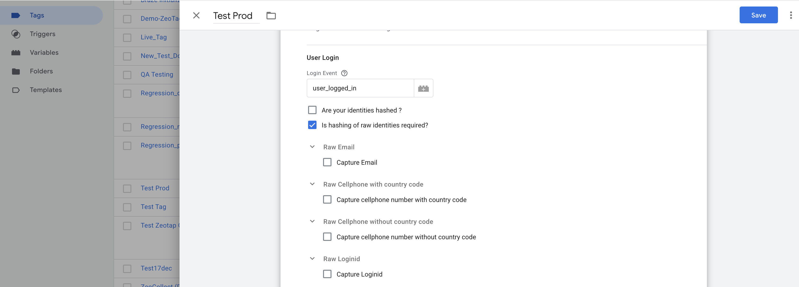
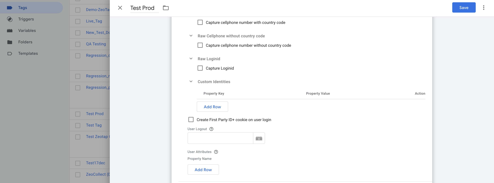

# 3. Login and Identity Settings

This section of the Zeotap Collect Tag setup guides you through configuring how login events and identity information (such as email, phone number, and login ID) are handled within Google Tag Manager (GTM).

---

## Login Event

**Purpose**: Specifies the `dataLayer` event name that is fired when a user logs in or when an user identity is to stored. 

:::note 
  These Identities will be stored and persisted across all the subsequent calls to zeotap. 
:::

**Example:**

```js
dataLayer.push({
  event: 'user_logged_in',
  email: 'user@example.com',
  phone: '1 4155552671',
  loginid: 'user123'
});
```

**Action**:  
In the tag configuration, set the Login Event field to match your event name (e.g., `user_logged_in`).
 


---

## Are Your Identities Hashed?

Check this option **only** if your identity values (email, phone, login ID) are already hashed when pushed to the `dataLayer`.

### Configuration for Hashed Identities:

#### Hashed Email

- Enable: **"Capture hashed email"**
- Click **Add Row**:
  - Select **Hash Algorithm** (e.g., SHA-256)
  - Choose your GTM Variable (e.g., `{{Hashed Email}}`)

####  Hashed Cellphone with Country Code

- Enable: **"Capture hashed cellphone number with country code"**
- Click **Add Row**:
  - Select **Hash Algorithm** (e.g., SHA-256)
  - Choose your GTM Variable (e.g., `{{Hashed Phone}}`)

####  Hashed Login ID

- Enable: **"Capture hashed Loginid"**
- Click **Add Row**:
  - Select **Hash Algorithm** (e.g., SHA-256)
  - Choose your GTM Variable (e.g., `{{Hashed Login ID}}`)

 

---

##  Is Hashing of Raw Identities Required?

Enable this **only** if your identity values are in raw format (e.g., plain email or phone) and need to be **hashed by the tag** before sending to Zeotap.

###  Configuration for Raw Identities:

####  Raw Email

- Enable: **"Capture Email"**
- Select Variable (e.g., `{{Email}}`)

####  Raw Cellphone with Country Code

- Enable: **"Capture cellphone number with country code"**
- Select Variable (e.g., `{{Phone Number}}`)

####  Raw Login ID

- Enable: **"Capture Loginid"**
- Select Variable (e.g., `{{Login ID}}`)

To learn more about supported hashing algorithms and formatting guidelines, [refer to our hashing guidelines](#).  //TODO


---

//TODO

:::warning Deprecated
ID+ usage is deprecated.
:::

##  Create First Party ID+ Cookie on Login

If you are a **Publisher using Zeotap’s ID+ services**, enable this checkbox to trigger the creation of a first-party ID+ cookie on user login.

>  This requires that you have enabled ID+ for your organization.


##  Organisation Partner ID

Enter the **Partner ID** provided by Zeotap.  
This field is required for using ID+ services.

> Example: `zeotap-partner-12345`


---

##  User Logout

**Purpose**: Identifies the `dataLayer` event that should **unset identity values** (email, phone, loginid) from the user profile.

**Example:**

```js
dataLayer.push({
  event: 'user_logged_out'
});
```

**Action**:  
Set this to the event name (e.g., `user_logged_out`) in your tag configuration.



---

##  User Attributes

Use this section to provide **additional user information** to be sent to Zeotap.

### Example GTM Variables:

| Attribute Key    | GTM Variable            |
|------------------|--------------------------|
| userType         | `{{User Type}}`          |
| subscriptionPlan | `{{Subscription Plan}}`  |
| loyaltyScore     | `{{Loyalty Score}}`      |

**Action**:  
Map each GTM variable to the corresponding attribute key. These will be included in `setUserProperties`.

A call to zeotap will be made with `eventName: 'set_user_properties'` with the set user properties in the user node of the paylod.

:::note
These properties are not persisted across subsequent calls to zeotap.
:::


---

Still need help? [Contact Zeotap Support](https://www.zeotap.com/contact-us)
