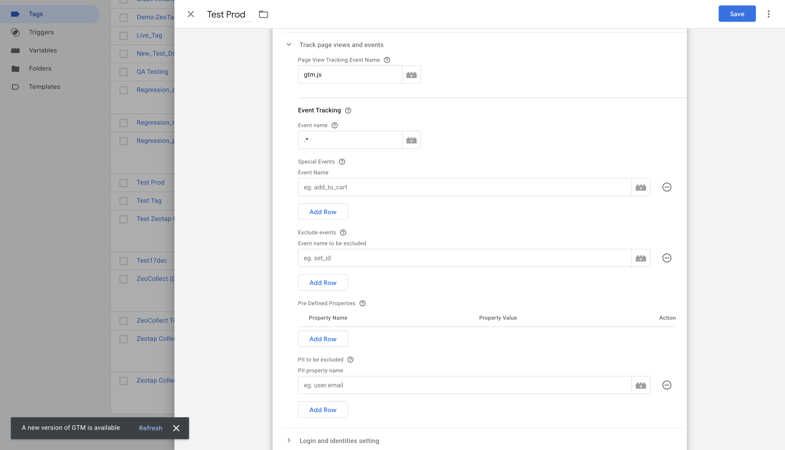

# 2. Tracking Page Views and Events

This section of the Zeotap Collect Tag configuration in GTM dictates how the tag identifies and processes page view events and other custom interactions occurring on your website. Proper setup here ensures that all relevant user activities are captured.

Configure the following fields to define your tracking strategy:

### 1. Page View Tracking Event Name

*   **Purpose**: Specifies the `dataLayer` event name that signifies a page view.
*   **Default Behavior**: By default, the Zeotap Collect Tag is configured to track page views when the standard GTM event `gtm.js` (often associated with the initial GTM container load on a page) is pushed to the dataLayer.
*   **Configuration**: 
    *   If your setup uses `gtm.js` for page views, you can leave this field as is.
    *   If you use a different `dataLayer` event name to denote a page view (e.g., `virtualPageView`, `customPageView`), you **must** update this input field with that specific event name to ensure page views are correctly tracked.
*   **Action**: Enter your custom page view event name if it differs from `gtm.js`.

### 2. Event Tracking (Regex)

*   **Purpose**: Defines a regular expression (regex) pattern to identify and track multiple custom `dataLayer` event names.
*   **Default Behavior**: The template often defaults to `.*` (dot star). This regex pattern means "match any character (`.`) zero or more times (`*`)", effectively tracking **all** events pushed to the dataLayer (except possibly some GTM internal ones, depending on trigger setup).
*   **Configuration**:
    *   **Track all events**: Keep `.*` if you intend to capture every dataLayer event.
    *   **Track specific events by pattern**: If your trackable events follow a common naming convention (e.g., `event_product_view`, `event_add_to_cart`), you can use a more specific regex like `^event_.*` to capture all events starting with "event_".
    *   **Track a single event**: If you only want this configuration to apply to one specific event name and you are not using the "Special Events" field for it, you can enter the exact event name here (e.g., `mySpecificEvent`). However, using regex is more flexible for multiple events.
*   **Action**: Enter a regex pattern that matches all the custom event names you wish to track with this tag configuration. 

### 3. Special Events

*   **Purpose**: Allows you to explicitly list specific `dataLayer` event names that you want to track, especially if they don't fit the general pattern in the "Event Tracking (Regex)" field or if you want to ensure they are definitely included.
*   **Use Case**: 
    *   Tracking unique, important events that don't conform to a common naming pattern.
    *   Adding specific events in addition to a broader regex pattern.
*   **Configuration**: Enter a of exact event names (e.g., `video_played`,`form_submitted_newsletter`,`special_promo_click`).
*   **Action**: List any specific event names here that need to be tracked, separate from or in addition to the regex pattern.

### 4. Exclude Events

*   **Purpose**: Allows you to explicitly list specific `dataLayer` event names that should be **completely ignored** by the Zeotap Collect Tag. If an event name matches one in this list, the tag will not process it, and no data related to this event will be sent to Zeotap.
*   **Use Case**:
    *   Preventing internal or purely functional `dataLayer` events (e.g., `ui_element_rendered`, `internal_debug_event`) that are not relevant for Zeotap data collection from triggering the tag.
    *   Excluding events that are handled by other specific tags or systems and should not be duplicated or processed by Zeotap.
    *   Temporarily disabling tracking for certain events without removing them from the `dataLayer` or modifying broader regex/special event configurations.
*   **Configuration**: Enter a list of exact event names (e.g., `do_not_track_this`,`internal_event`,`another_ignored_event`). The matching is case-sensitive.
*   **Action**: List any specific event names here that should be entirely excluded from Zeotap tracking.

### 5. Pre-defined Properties

*   **Purpose**: Allows you to statically attach new properties to the tracked events or override existing property values coming from the `dataLayer`.
*   **Use Case**:
    *   Adding a static campaign identifier to all events tracked by this tag.
    *   Overriding a `dataLayer` variable with a fixed value for specific reporting needs.
    *   Enriching events with context available in GTM variables but not directly in the event's dataLayer push.
*   **Configuration**: This field usually allows you to create key-value pairs.
    *   **Key**: The name of the property you want to add/override (e.g., `event_source`, `custom_dimension_1`).
    *   **Value**: The value for this property. This can be a static value (e.g., "GTM_Zeotap_Tag") or a GTM variable (e.g., `{{My GTM Variable}}`, `{{Page Path}}`).
*   **Action**: Input the properties you want to attach or override, defining their keys and corresponding static or dynamic (GTM variable) values.

### 6. PII to be Excluded

*   **Purpose**: Specifies a list of keys (property names) from the `dataLayer` that should be excluded from event properties sent to Zeotap. This is crucial for protecting user privacy and preventing the ingestion of Personally Identifiable Information (PII) or other sensitive/non-essential data.
*   **Behavior**: Any key listed here will be removed from the event data before it is sent to Zeotap's collection servers.
*   **Example**: If your `dataLayer` pushes an event like `dataLayer.push({ 'event': 'user_update', 'email': 'user@example.com', 'userID': '123', 'preference': 'dark_mode'})`, and you list `email` in this exclusion field, the `email` property will be stripped from the collected event data.
*   **Important Considerations**:
    *   Always ensure PII (e.g., raw email addresses, full names, precise addresses unless specifically and consensually handled for hashing/identification in other parts of the config) is excluded if it appears in its raw form in general event data.
    *   This option is also useful for excluding other non-essential keys that are present in the `dataLayer` but not needed for analytics or activation in Zeotap, helping to keep your collected data clean and relevant.
*   **Blacklisted Fields**: Certain fields, such as `country` and `city`, are often automatically blacklisted for ingestion by Zeotap's systems because this information is typically derived with higher accuracy from the user's IP address on the server-side. 
    *   For a complete and up-to-date list of fields that are automatically blacklisted by Zeotap, please refer to the official Zeotap documentation or contact your Zeotap representative. ([Placeholder for link to blacklisted fields](#)). //TODO
*   **Action**: Enter the list of all PII and other user-related or non-essential dataLayer keys that need to be excluded from the event properties (e.g., `email`,`firstName`,`lastName`,`user_address`,`temp_calculation_var`).
