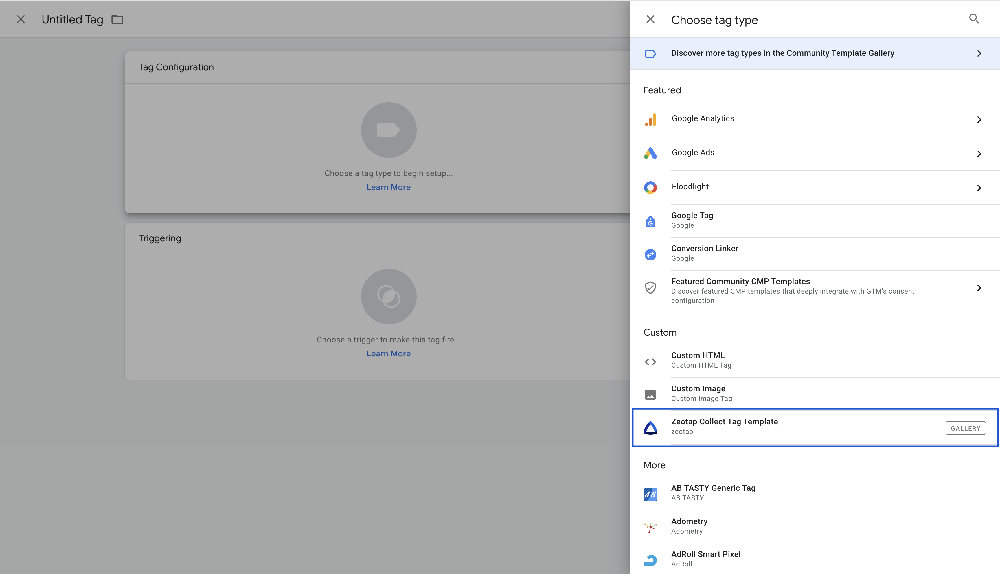
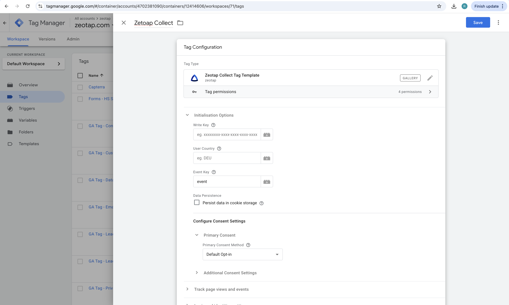

# Step 2: Adding the Zeotap Collect Tag

Once you have successfully added the Zeotap Collect Tag Template to your Google Tag Manager (GTM) workspace (either from the gallery or by importing the `.tpl` file), the next step is to add the actual tag that will use this template.

Follow these steps to add the Zeotap Collect Tag:

1.  **Navigate to Tags**:
    -   Log into your GTM account.
    -   From the left-hand navigation menu in your GTM workspace, click on **Tags**.

2.  **Create a New Tag**:
    -   Click the **New** button to create a new tag.
    -   Give your tag a descriptive name. For example, "Zeotap Collect" or "Zeotap Main Tag".

3.  **Add the Tag**:
    -   Click on the **Tag Configuration** block to choose a tag type.
    -   A panel will slide out from the right. In the "Choose tag type" search bar, or by scrolling, find the **Zeotap Collect Tag Template** that you added previously.
        -   **Important**: The Zeotap Collect Tag Template will be listed under the **Custom** section.

         

4.  **Select the Zeotap Collect Tag Template**:
    -   Click on the **Zeotap Collect Tag Template** from the list.
    -   This will open the configuration interface for the tag, based on the template's defined fields.

     

## Next Steps

After selecting the Zeotap Collect Tag Template, you will need to configure its various options, such as Initialization Options, Tracking settings, Login and Identities, etc. 

For detailed instructions on this, please proceed to the [**Step 3: Configure the Tag**](./configureTheTag.md) guide (link to be updated if filename differs). 