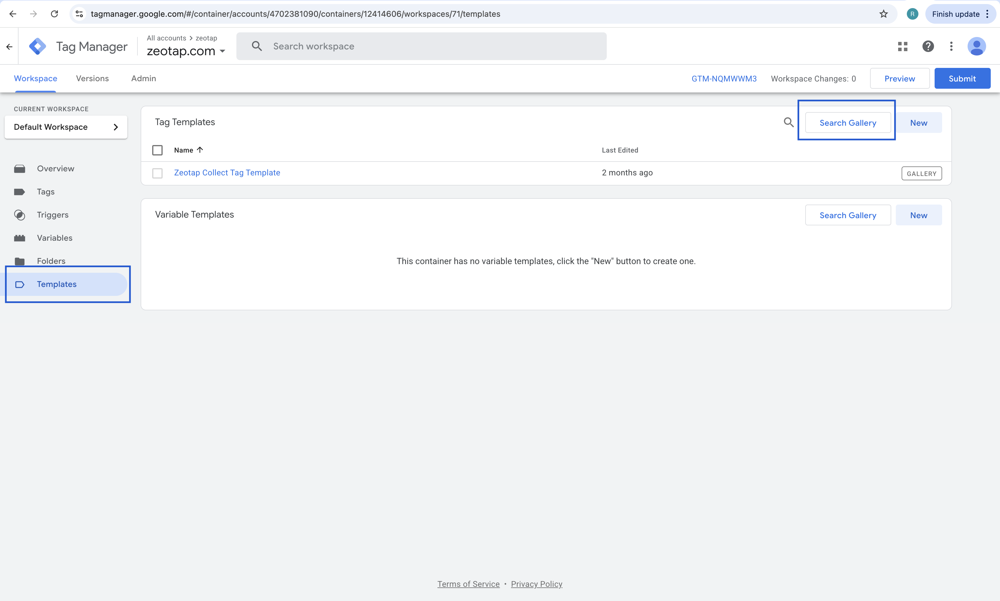
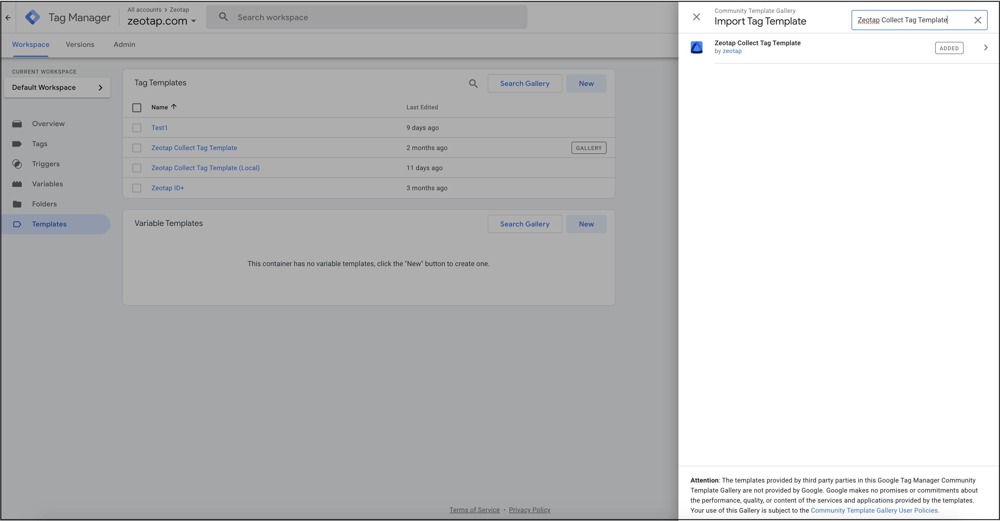

# Importing the Zeotap Collect Tag Template

This method describes how to add the Zeotap Collect Tag Template to your Google Tag Manager (GTM) workspace by searching the Community Template Gallery.

Follow these steps:

1.  **Log into your GTM Account**:
    Access your Google Tag Manager account at [tagmanager.google.com](https://tagmanager.google.com/).

2.  **Navigate to Templates**:
    In the left-hand navigation menu of your GTM workspace, click on **Templates**.

    

3.  **Access the Template Gallery**:
    Within the "Tag Templates" section, click on the **Search Gallery** button located on the top-right corner.

4.  **Search for Zeotap Collect Tag**:
    In the search bar that appears, type "Zeotap Collect Tag" and press Enter, or browse the list to find the **Zeotap Collect Tag Template**.

     

5.  **Select the Template**:
    Once you find the "Zeotap Collect Tag Template" in the search results, click on it to open the template details.

6.  **Add to Workspace**:
    Click the **Add to workspace** button. GTM will ask you to review the permissions the template requires.

7.  **Confirm Permissions**:
    Review the API permissions requested by the template. If you agree, click **Add** to incorporate the template into your GTM workspace.

After completing these steps, the Zeotap Collect Tag Template will be available in your workspace, ready for you to [configure and use](./configuration.md). 