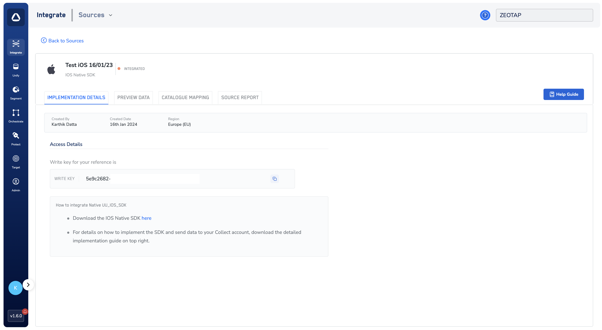

# Understanding Your Write Key

The **Write Key** is a unique identifier essential for integrating the Zeotap iOS SDK with your iOS application. It ensures that all data collected by the SDK is correctly attributed to your source in your Zeotap account.

## How to Obtain Your Write Key

You can find your Write Key within the Zeotap Customer Data Platform (CDP) after setting up an "iOS Native SDK Source."

**Here's a step-by-step guide:**

1.  **Access Zeotap CDP:**
    *   Log in to your Zeotap Customer Data Platform account. If you don't have access, please contact your Zeotap account manager or support team.

2.  **Create or Locate Your iOS Native SDK Source:**
    *   **If you haven't already, create a new "iOS Native SDK Source"** within the CDP. This source represents your iOS application where you'll be implementing the SDK. For detailed instructions, refer to the [official Zeotap documentation on creating an iOS SDK source](https://docs.zeotap.com/articles/#!integrate-customer/create-an-ios-sdk-source).
    *   **If you have an existing source,** navigate to integrate > sources section where all sources are listed.

3.  **View Source Details & Find the Write Key:**
    *   Once you've selected or created your iOS Native SDK Source, go to its "Implementation Details" section.
    *   The **Write Key** will be displayed here. It's a long string of alphanumeric characters.

    
    *(The image above shows an example of the Zeotap CDP interface where the Write Key can be found.)*

## Using the Write Key in Your SDK Initialization

When you initialize the Zeotap iOS SDK in your application's code, the Write Key is the first and most crucial parameter you provide:

```swift
import ZeotapCollect

func application(_ application: UIApplication, didFinishLaunchingWithOptions launchOptions: [UIApplication.LaunchOptionsKey: Any]?) -> Bool {
    
    // Initialize with your write key
    var collectOptions = CollectOption().writeKey(value: "YOUR_WRITE_KEY")
                                      // Other SDK Configurations options
                                      .build()
    Collect.initialize(option: collectOptions)
    
    return true
}
```

## Troubleshooting

### Common Issues

1. **Invalid Write Key Error**
   - Verify the write key is correctly copied from Zeotap CDP
   - Ensure there are no extra spaces or characters
   - Check that the write key is for an iOS source

2. **Data Not Appearing in Zeotap CDP**
   - Confirm the write key belongs to the correct account
   - Verify the source is properly configured
   - Check network connectivity and app permissions


## Related Documentation

- [Quick Start Guide](../quickStart): Learn how to integrate the SDK
- [API Reference](../APIReference/setUserIdentities): Explore available methods