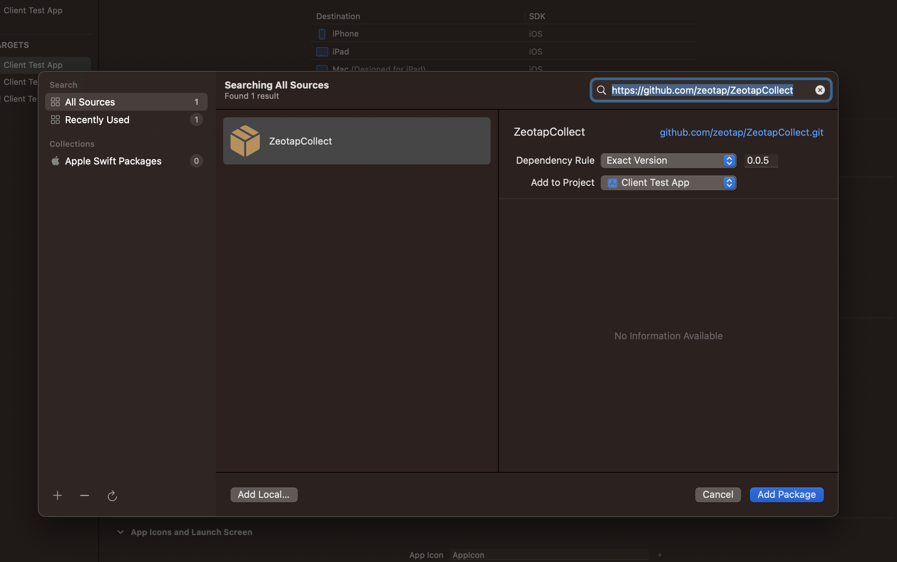
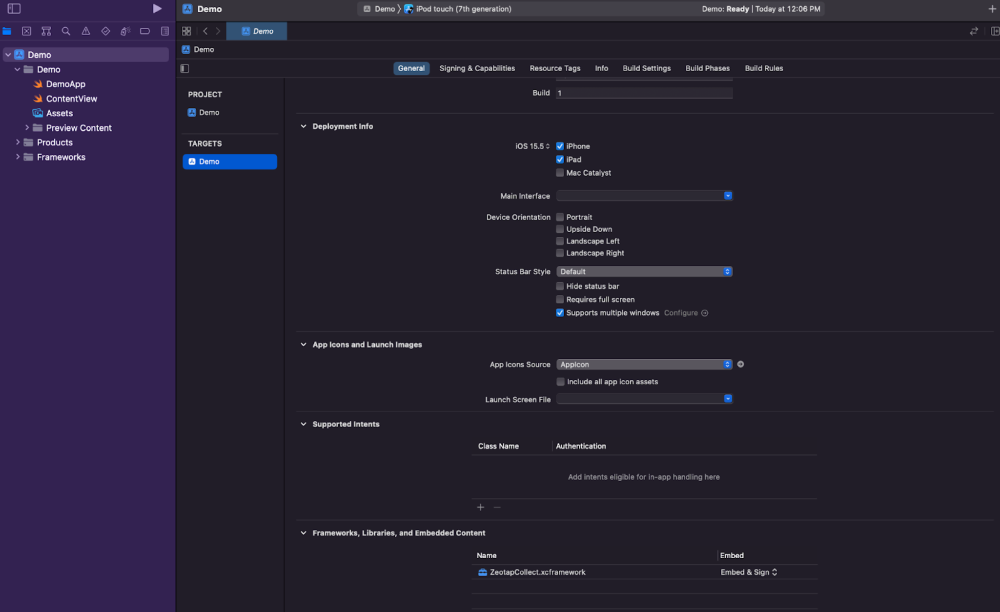

## Setup in Zeotap CDP

Create an iOS source in your Zeotap CDP account. [How to create an iOS source?](https://docs.zeotap.com/articles/#!integrate-customer/create-an-ios-sdk-source)

Obtain the write key from the created source. [How to obtain a write key?](./Configurations/writeKey)

## Installation

### CocoaPods (Recommended)

Add the following line to your `Podfile`:

```ruby
pod 'ZeotapCollect', '~> 1.0.0'
```

Then run:

```bash
pod install
```

### Swift Package Manager

1. Open your project in Xcode
2. Go to **File** → **Add Package Dependencies**
3. Enter the repository URL: `https://github.com/zeotap/ZeotapCollect`
4. Click **Add Package**
5. Select the target where you want to add the SDK



### Manual Installation

1. Download the latest release from [here](https://content.zeotap.com/ios-sdk/ios-collect-sdk.zip) and Unzip it.
2. Launch the project settings by **PROJECT** → **TARGET** → **General** → scroll and find **Frameworks, Libraries and Embedded Content**
2. Add the `ZeotapCollect.xcframework` into your Xcode project



## Initialization

Import the SDK in your AppDelegate or main app file:

```swift
import ZeotapCollect
```

Initialize the SDK in your `application(_:didFinishLaunchingWithOptions:)` method:

```swift
func application(_ application: UIApplication, didFinishLaunchingWithOptions launchOptions: [UIApplication.LaunchOptionsKey: Any]?) -> Bool {
    
    // Initialize Zeotap Collect SDK
    var collectOptions = CollectOption().writeKey(value: "YOUR_WRITE_KEY")
                                      .logging(value: false)
                                      .optout(value: false)
                                      .build()
    Collect.initialize(option: collectOptions)
    
    return true
}
```

:::info
You need to input your [```write key```](./Configurations/writeKey) in place of ```YOUR_WRITE_KEY``` so that the data gets ingested to an ***iOS source*** created in your Zeotap CDP account.
:::

## Setting up User Identities <span style={{"fontSize": "15px"}}>[(Learn more)](./APIReference/setUserIdentities)</span>

Once the Zeotap SDK is integrated, you can start setting up user identities. User identities are how you associate data to specific users.

The Zeotap iOS SDK provides the `setUserIdentities` function to identify your users:

```swift
Collect.getInstance()?.setUserIdentities([
    "email": "user@example.com",
    "cellno": "+1 5551234567"
])
```

## Setting User Properties <span style={{"fontSize": "15px"}}>[(Learn more)](./APIReference/setUserProperties)</span>

User properties allow you to store information about your users that doesn't change frequently, such as subscription status, user preferences, or demographic information.

To set user properties, use the `setUserProperties` method:

```swift
Collect.getInstance()?.setUserProperties([
    "subscription": "premium",
    "age": 25,
    "city": "New York"
])
```

## Tracking User Events <span style={{"fontSize": "15px"}}>[(Learn more)](./APIReference/track)</span>

Event tracking allows you to track specific actions that users take in your app, such as making a purchase, completing a level, or sharing content.

To track user events, you can use the `setEventProperties` method:

```swift
Collect.getInstance()?.setEventProperties("Product Purchased", [
    "productId": "12345",
    "productName": "iPhone 15",
    "category": "Electronics",
    "price": 999.99,
    "currency": "USD"
])
```

## Example Integration

Here's a complete example of how to integrate the Zeotap iOS SDK:

```swift
import UIKit
import ZeotapCollect

@main
class AppDelegate: UIResponder, UIApplicationDelegate {

    func application(_ application: UIApplication, didFinishLaunchingWithOptions launchOptions: [UIApplication.LaunchOptionsKey: Any]?) -> Bool {
        
        // Initialize Zeotap Collect SDK
        var collectOptions = CollectOption().writeKey(value: "YOUR_WRITE_KEY")
                                          .logging(value: false)
                                          .optout(value: false)
                                          .build()
        Collect.initialize(option: collectOptions)
        
        // Set user identities after login
        Collect.getInstance().setUserIdentities([
            "email": "user@example.com",
            "userId": "12345"
        ])
        
        // Set user properties
        Collect.getInstance()?.setUserProperties([
            "subscription": "premium",
            "appVersion": Bundle.main.infoDictionary?["CFBundleShortVersionString"] as? String ?? "unknown"
        ])
        
        return true
    }
}

class ViewController: UIViewController {
    
    @IBAction func purchaseButtonTapped(_ sender: UIButton) {
        // Track purchase event
        Collect.getInstance()?.setEventProperties( "Product Purchased", properties: [
            "productId": "12345",
            "price": 29.99,
            "currency": "USD"
        ])
    }
}
```