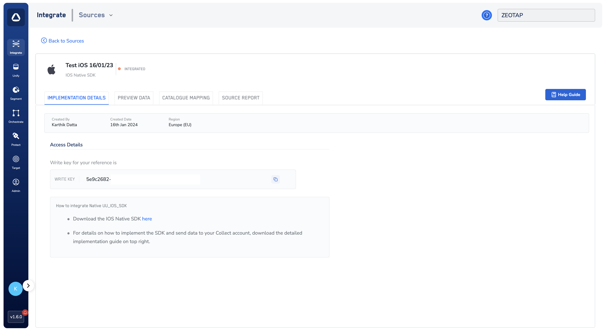

# Understanding Your Write Keys

The **Write Keys** are unique identifiers essential for integrating the Zeotap React Native SDK with your mobile application. You need separate write keys for Android and iOS platforms to ensure that all data collected by the SDK is correctly attributed to your sources in your Zeotap account.

## How to Obtain Your Write Keys

You can find your Write Keys within the Zeotap Customer Data Platform (CDP) after setting up both "Android Native SDK Source" and "iOS Native SDK Source."

**Here's a step-by-step guide:**

1.  **Access Zeotap CDP:**
    *   Log in to your Zeotap Customer Data Platform account. If you don't have access, please contact your Zeotap account manager or support team.

2.  **Create or Locate Your Native SDK Sources:**
    *   **If you haven't already, create both "Android Native SDK Source" and "iOS Native SDK Source"** within the CDP. These sources represent your React Native application's Android and iOS builds where you'll be implementing the SDK.
    *   **If you have existing sources,** navigate to integrate > sources section where all sources are listed.

3.  **View Source Details & Find the Write Keys:**
    *   For each source (Android and iOS), go to their respective "Implementation Details" sections.
    *   The **Write Key** will be displayed in each source. They are long strings of alphanumeric characters.
    *   **Important:** Make sure to copy the correct write key for each platform.

    
    *(The image above shows an example of the Zeotap CDP interface where the Write Key can be found.)*

## Using the Write Keys in Your SDK Initialization

When you initialize the Zeotap React Native SDK in your application's code, both Write Keys are required parameters:

```javascript
import { initialiseZeoCollect } from 'zeo-collect';

const options = {
    android_write_key: "YOUR_ANDROID_WRITE_KEY",    // Write key for Android source
    ios_write_key: "YOUR_IOS_WRITE_KEY",            // Write key for iOS source
    // Other configuration options...
};

initialiseZeoCollect(options, (response) => {
    console.log("SDK initialized:", response);
});
```

## Platform-Specific Configuration

### Android Write Key
- Obtained from your "Android Native SDK Source" in Zeotap CDP
- Used when your React Native app runs on Android devices
- Must be a valid Android source write key

### iOS Write Key  
- Obtained from your "iOS Native SDK Source" in Zeotap CDP
- Used when your React Native app runs on iOS devices
- Must be a valid iOS source write key

## Troubleshooting

### Common Issues

1. **Invalid Write Key Error**
   - Verify both write keys are correctly copied from Zeotap CDP
   - Ensure there are no extra spaces or characters
   - Check that Android write key is from an Android source and iOS write key is from an iOS source
   - Confirm both write keys belong to the same Zeotap account

2. **Data Not Appearing in Zeotap CDP**
   - Confirm the write keys belong to the correct account
   - Verify both sources are properly configured
   - Check network connectivity and app permissions
   - Ensure you're looking at the correct source in the CDP

3. **Platform-Specific Issues**
   - Verify Android events appear in the Android source
   - Verify iOS events appear in the iOS source
   - Check that the correct write key is being used for each platform

## Security Best Practices

1. **Environment Variables**: Store write keys in environment variables or secure configuration files
2. **Version Control**: Never commit write keys directly to version control
3. **Access Control**: Limit access to write keys to authorized team members only
4. **Regular Rotation**: Consider rotating write keys periodically for enhanced security

## Related Documentation

- [Quick Start Guide](../quickStart): Learn how to integrate the SDK
- [Configuration Options](./configurations): Explore all configuration options
- [API Reference](../APIReference/setUserIdentities): Explore available methods